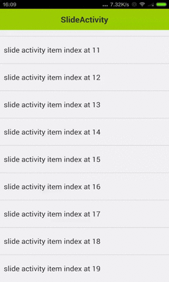

SlideActivity
=============

A iOS like slide back Activity framework, slide left edge to exit current activity. 

If you have any idea to improve this project, any commits welcomed:)

download demo in Google Play [SlideActivity](https://play.google.com/store/apps/details?id=com.chenjishi.slidedemo&hl=zh-CN)
## ScreenShot
<p align="center">
  
</p>

## Usage

### 1.Extend SlideActivity
```
public class DetailActivity extends SlideActivity {

    @Override
    protected void onCreate(Bundle savedInstanceState) {
        super.onCreate(savedInstanceState);
        setContentView(R.layout.activity_detail);        
    }
}
```

### 2.Start Activity By Slide Method
```
public void onButtonClicked(View v) {
        Intent intent = new Intent(this, ImageActivity.class);
        Slide.getInstance().startActivity(this, intent);
    }
```

### All Done!


